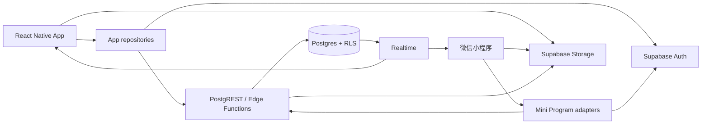

# 91YOYO 跨端技术架构

版本：v0.1  
更新日期：2026-09-15

## 1. 架构目标

近期优先交付 React Native App，同时保证微信小程序能在不重写后端的前提下接入。共享边界是账号、业务数据、对象存储、字段语义和权限规则；React Native 组件、Uni-app 组件、导航和平台媒体实现保持独立。

## 2. 总体结构



### 客户端层

- App：Expo + React Native，负责原生播放器、后台音频、推送、系统相册和位置权限。
- 小程序：Uni-app + Vue 3，负责微信授权、微信媒体 API、订阅消息和小程序审核适配。
- 两端分别维护 adapter，将相同 JSON DTO 转换为各自页面状态。页面不得直接读取数据库表名或构造 PostgREST 查询。

### 共享后端层

- Supabase Auth：手机验证码会话；App 可在后续增加 Apple 登录，小程序可增加微信快捷登录绑定。
- Postgres：业务事实来源，使用约束、外键、事务和 RLS 保证一致性。
- Storage：保存头像、帖子图片、视频、音频、装备媒体和聊天图片。
- Realtime：首期只用于私聊消息和必要的未读状态；Feed 通过刷新/分页获取。
- Edge Functions：只承载需要服务端密钥或事务编排的操作，如微信身份交换、上传确认、内容审核回调、推送和账号注销。

## 3. App 内部分层

建议在现有 `src` 下逐步形成以下边界：

```text
src/
  features/           # 按 auth、feed、media、profile 等业务聚合页面和组件
  services/
    supabase/         # 客户端初始化、会话存储、生成类型
    repositories/     # 业务查询与写入接口
    uploads/          # 媒体校验、上传、重试与确认
  stores/             # 仅保存跨页面 UI/会话状态，不作为服务端事实来源
  types/              # API DTO 与领域类型
  navigation/
  constants/
```

职责规则：

- Screen 负责交互和呈现，不知道表结构。
- Repository 返回稳定 DTO，集中处理分页、错误映射和数据库字段转换。
- Zustand 保存会话、播放器和短期筛选状态；Feed 以服务端缓存为准，不继续把 Mock Store 当数据库。
- Supabase 生成类型只在 service 层使用，避免数据库列名扩散到整个 UI。

## 4. 数据访问策略

第一阶段采用 Supabase 原生能力，减少独立后端运维：

- 常规读取与单表写入：repository 通过 Supabase SDK/PostgREST，依赖 RLS 授权。
- 多表原子写入：数据库函数（RPC）或 Edge Function 事务编排。
- 管理与审核：仅服务端使用 service role；移动端和小程序永远只持有公开 URL 与 anon key。
- 媒体：客户端获取受限路径后直传 Storage，完成上传后再确认媒体记录。

小程序若无法稳定运行 `supabase-js`，使用 `uni.request` 调用相同 Auth REST、PostgREST/RPC 和 Edge Function；DTO 与错误码保持一致。

## 5. 认证与跨端账号

### 基础方案

1. 两端使用手机号验证码建立 Supabase 会话。
2. `auth.users.id` 与 `profiles.id` 一一对应，所有业务表引用 `profiles.id`。
3. 手机号只存在 Auth 的受保护数据中，公开 `profiles` 不存手机号。
4. 用户换端后用相同手机号登录，即获得相同 `profileId` 和业务数据。

### 微信快捷登录

后续由 Edge Function 接收 `wx.login` code，服务端向微信换取 `openid/unionid`，再维护 `user_identities` 绑定。快捷登录必须返回标准受控会话，并遵循：

- 首次绑定需要手机验证，或清楚提示将创建新账号。
- 已绑定的微信身份不能在客户端改绑。
- 同一 `provider + subject` 全局唯一。
- 账号合并由服务端事务完成，并保留审计记录。

## 6. 媒体链路

```text
系统选择文件
  → 客户端校验类型/大小/时长
  → 创建 pending media 记录
  → 上传到 userId/yyyy/mm/randomName
  → 服务端校验对象元数据
  → media 状态改为 ready
  → 创建帖子并关联 media
  → 异步转码/缩略图/审核
  → 状态 published 或 rejected
```

客户端不能信任文件扩展名；服务端检查 MIME、对象大小和所有权。私有原文件使用私有 bucket 和短期签名 URL，公开封面可使用独立公开 bucket/CDN。

## 7. 权限与安全

- 所有包含用户数据的表启用 RLS，RLS 列必须建索引。
- `anon` 只能读取已发布的公开内容；`authenticated` 只能修改自己拥有的记录。
- “仅关注者”由数据库策略或 security-definer helper 判断，不由客户端过滤。
- 聊天仅会话成员可读写；拉黑后禁止新建会话和发送消息。
- 删除默认采用业务状态/`deleted_at`，媒体由延迟任务清理，避免数据库回滚后文件已永久删除。
- Edge Function 日志不输出 Authorization、验证码、微信 code 或私聊正文。

## 8. 环境与发布

至少维护 development、staging、production 三套 Supabase 项目。数据库变更只通过版本化 migration 进入环境；禁止在生产控制台手工改表后不回写 migration。

App 使用 `EXPO_PUBLIC_*` 注入可公开配置。service role、短信供应商、微信 secret、推送凭据只配置在 Supabase/CI 服务端 secret 中。

## 9. 可观测性

- 客户端记录崩溃、页面失败、API 延迟、上传阶段和播放错误，不记录敏感正文。
- 后端记录请求 ID、用户 ID、操作类型、耗时和稳定错误码。
- App 每个请求生成 `X-Request-Id`，便于客户端错误与服务端日志关联。
- 上线门槛关注登录成功率、Feed 成功率、上传成功率、播放启动失败率和崩溃自由会话。

## 10. 架构演进触发条件

当出现复杂推荐、支付账务、大规模转码或 Supabase Edge Function 无法满足的长任务时，再引入独立后端/任务队列。引入后仍保持 v1 API DTO，不要求两端同步重写页面。
