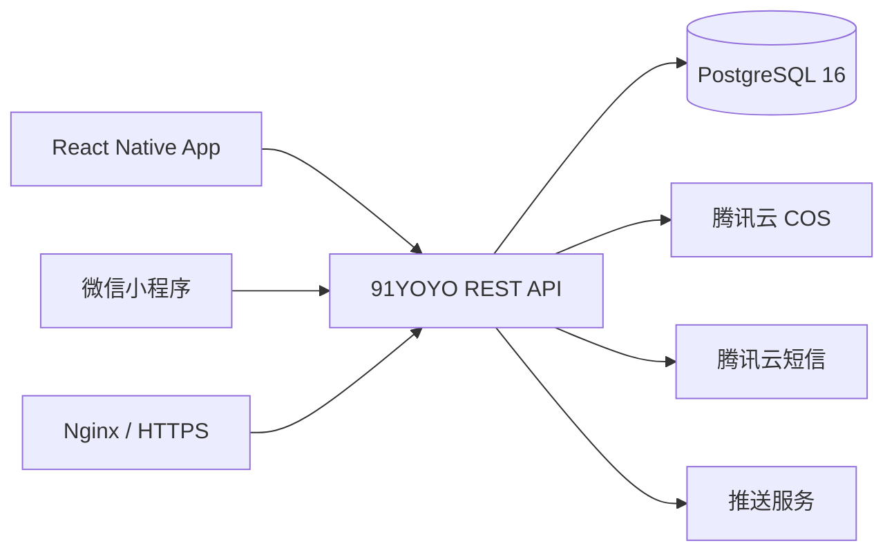

# 91YOYO 跨端技术架构

版本：v0.2
更新日期：2026-09-15

## 1. 架构目标

React Native App 是当前开发主线，微信小程序后续接入相同 REST API。两端共享账号、业务数据、对象存储和字段语义，但分别实现 UI、导航和平台媒体能力。

## 2. 总体结构



当前开发部署：

- API：腾讯云轻量服务器，systemd 服务 `91yoyo-api.service`。
- 内部监听：`127.0.0.1:8791`，不直接开放公网。
- 数据库：同机 PostgreSQL 16，数据库和账号均为 `yoyo_app`，只监听 localhost。
- 媒体：腾讯云 COS，数据库只保存 bucket 和 object key。
- 本地联调：Mac 通过 SSH 隧道将服务器 `8791` 映射到本机 `127.0.0.1:8791`。

## 3. 客户端边界

- Screen 负责交互和呈现，不知道数据库表结构。
- `src/services` 负责请求、超时、错误映射和 DTO 校验。
- Zustand 保存短期 UI 状态，不作为服务端事实来源。
- App 通过 `EXPO_PUBLIC_API_BASE_URL` 选择环境，客户端不保存数据库或 COS Secret。
- 小程序使用 `uni.request` 调用同一 API，并复用契约 fixtures。

## 4. 服务端边界

`server/` 是独立 Fastify + TypeScript 服务：

```text
server/
  src/app.ts             # HTTP 路由与错误边界
  src/database.ts        # PostgreSQL 连接池
  src/feedRepository.ts  # Feed 查询和游标分页
  src/cos.ts             # COS 健康检查与后续签名上传
  src/config.ts          # 服务器环境校验
  migrations/            # 版本化数据库结构与开发种子
```

业务模块按路由、service、repository 继续拆分。只有 repository 可以写 SQL；只有 COS service 可以读取 COS 凭据。

## 5. 认证方案

计划使用服务端手机号验证码认证：

1. API 调用腾讯云短信发送验证码，只保存验证码哈希、过期时间和尝试次数。
2. 验证成功后签发短期 access token 和可撤销 refresh token。
3. refresh token 哈希保存在数据库；App 使用系统安全存储。
4. 小程序微信登录由 API 使用 `wx.login` code 换取身份，并绑定同一手机号账号。

腾讯云短信签名和模板尚未配置，因此当前只开放匿名公共 Feed，不提供假验证码。

## 6. 媒体链路

```text
客户端选择文件
  → API 校验类型/大小并生成限时 COS 上传签名
  → 客户端直传 COS 的用户隔离前缀
  → API 校验对象元数据并创建 media_assets
  → 创建帖子并关联媒体
  → 异步转码/缩略图/审核
```

生产媒体 bucket 使用私有读；API 按用户权限生成短期下载 URL。SecretId/SecretKey 永远不返回客户端。

## 7. 安全规则

- PostgreSQL 和 API 内部端口都不开放公网，只由 Nginx 暴露 HTTPS API。
- `yoyo_app` 账号不是超级用户，不能创建数据库或角色。
- 所有写接口校验 token 所有者、输入长度、幂等键和资源状态。
- COS 上传路径由服务端生成，客户端不能指定任意 bucket/key。
- 日志不记录验证码、token、COS 密钥、手机号全文或私聊正文。
- 现阶段复用的 COS 凭据后续应替换为 91YOYO 专用 CAM 子账号和最小前缀权限。

## 8. 环境与发布

- development：本机模拟器 + SSH 隧道 + 服务器开发 API。
- staging：独立数据库/schema、COS 前缀和 API 子域名。
- production：备案 HTTPS 域名、独立密钥、备份、告警和限流。

数据库结构只通过 `server/migrations` 变更。正式环境不允许手工改表后不回写 migration。

## 9. 扩容触发条件

当前 4 核 4GB 服务器可用于早期阶段。出现以下情况时迁移到腾讯云数据库或独立服务：可用内存长期低于 800MB、数据库连接/IO 成为瓶颈、需要多实例 API、视频转码抢占 CPU，或交易账务进入生产范围。
